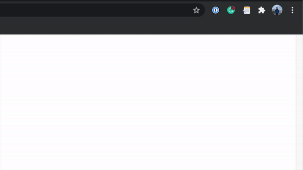
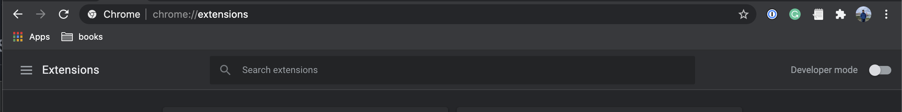
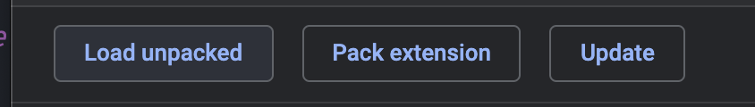
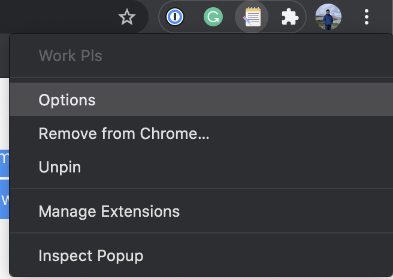
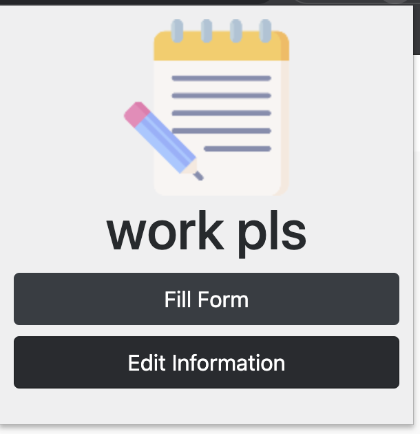

# Work, Pls.

A Chrome Extension that allows you to fill common fields on a job app once to autofill for your job applications! 



## Features
Currently, we support common input fields on most **Lever** and **Greenhouse** Applicant Tracking System (ATS) forms. This includes: 
- Personal/Contact Information (Name, Phone, Email)
- External Website Links (LinkedIn, Portfolio, Twitter)
- US Equal Employment Oppurtunity (EEO) Forms 

Also, there's a handy *Activity Tracker* to let you know all the jobs you've applied to! 

_Note: This records every page you click fill, not every form you submit!_

## Installation and Usage
Clone this repository
```bash
git clone https://github.com/jeffrey-hui/workpls.git
```

Open Chrome to `Chrome://Extensions` and toggle on developer mode



Click `Load Unpacked` and select the `workpls/` folder



Open the Options Menu to fill out your details 



When you're on a lever apply page or greenhouse apply page, you can toggle the menu to fill in the fields



## Beta Disclaimer/Data
This project came about as a weekend hack, so it's still quite rough around the edges. All data is saved locally in your browser. You can read more about how `chrome.storage.local` works [here](https://developer.chrome.com/extensions/storage). It's september as I'm writing this, so I'm hoping this could help a lot of folks speed up their job/internship searches! Good Luck!

